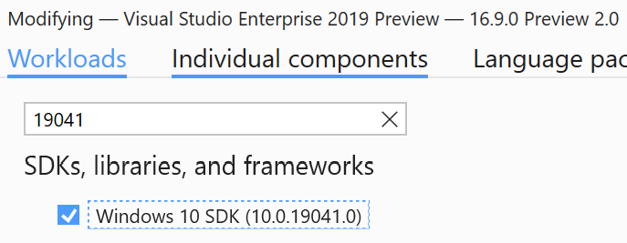
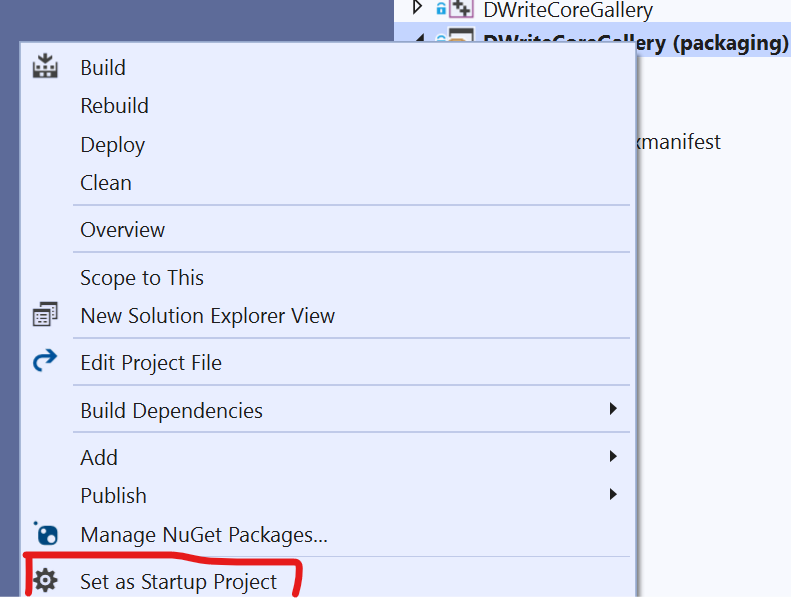
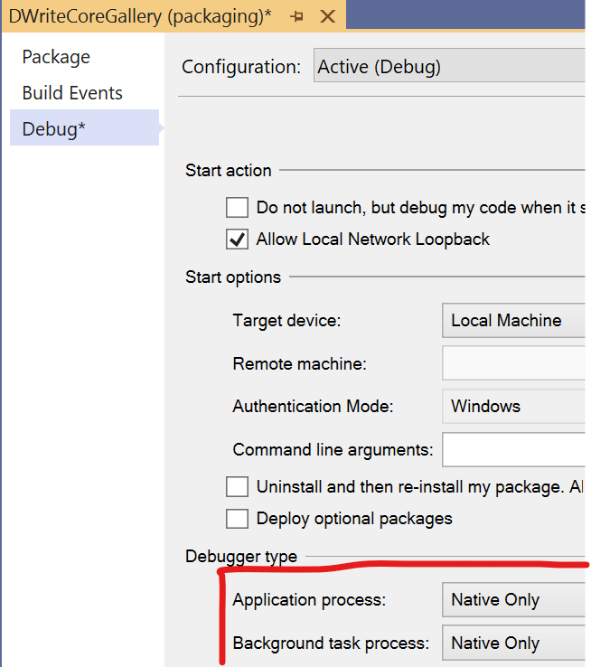

# DWriteCore gallery sample

This sample application demonstrates the DWriteCore API, which is a reimplementation of the Windows DirectWrite API. Select 
items from the *Scenario* menu to see pages that demonstrate various API functionality.

DWriteCore is a low-level API for formatting and rendering text. It's a nano-COM API, meaning that it uses COM-style 
interfaces (derived from **IUnknown**), but it doesn't actually use the COM run-time. It's therefore not necessary to
call **CoCreateInstance** before using DWriteCore. Instead, call the **DWriteCreateFactory** function to create a factory
object (**IDWriteFactory7**), and then call factory methods to create other objects, or perform other actions.

## API Layers

The **text layout API** is the highest layer of the DWriteCore API. It includes *text format* objects (**IDWriteTextFormat4**),
which encapsulate formatting properties, and *text layout* objects (**IDWriteTextLayout4**), which represent formatted text
strings. A text layout object exposes methods for drawing, getting metrics, hit-testing, and so on. Paragraphs displayed within 
the running sample app are text layout objects.

The **font API** exposes information about fonts, and provides functionality needed for text layout and rendering. It includes
*font collection* objects (**IDWriteFontCollection3**), which are collections of fonts grouped into families, *font set* objects
(**IDWriteFontSet3**), which are flat collections of fonts, and *font face* objects (**IDWriteFontFace6**), which represent specific
fonts.

The **text rendering API** provides interfaces uses for rendering text. When you call a text layout object's **Draw** method,
it calls back to an interface (**IDWriteTextRenderer1**), which must be implemented by the application or by some other library.
The use of an abstract callback interface enables DWriteCore to be decoupled from any particular graphics engine. The text
renderer implementation can use text rendering APIs provided by DWriteCore to help with rendering glyphs. The **TextRenderer** 
class in this application provides a sample implementation of the **IDWriteTextRenderer1** interface.

The **text analysis API** provides low-level APIs for sophisticated applications that implement their own text layout engines.
This includes script analysis, bi-directional analysis, shaping, and so on.

## System requirements

* Windows 10

## Building, running, and studying the sample

1. Follow steps [here](https://docs.microsoft.com/en-us/windows/apps/project-reunion#set-up-your-development-environment) to set up environment.

2. Press Ctrl+Shift+B, or select **Build** \> **Build Solution**.

>You may get the following error when building the DWriteCoreGallery (packaging) project:
>
>`SDK folder containing 'UAP.props' for 'UAP 10.0.19041.0' cannot be located.`
>
>If so, you need to add the specified Windows SDK version to your Visual Studio 2019 installation. To do so, open Visual Studio
Installer, click the "Modify" button for your Visual Studio version, select the "Individual components" tab, type the SDK version
number (e.g., "19041") in the search box, select the SDK in the search results, and click the Modify button.

3. Set "DWriteCoreGallery (packaging)" as the startup project. Right click "DWriteCoreGallery (packaging)" and select "set as startup project" from the context menu. 

4. For debugging, it is recommended you change the debugger type for the "DWriteCoreGallery (packaging)" project to "Native Only".
In the project properties, select the "Debug" tab, and set the Debugger type for both "Application process" and "Background
task process" to "Native Only".

## Related Links

- [Project Reunion](https://docs.microsoft.com/en-us/windows/apps/project-reunion)
- [DWriteCore](https://docs.microsoft.com/en-us/windows/apps/project-reunion/dwritecore)