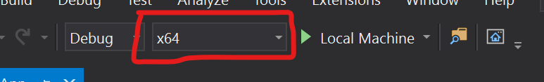

# Project Reunion Hello World Sample

This C++ sample demonstrates an instance of the "Blank App, Packaged (WinUI in Desktop)" project template (available in WinUI 3) that has been configured to include the Project Reunion NuGet package. This sample simply displays a button that, when pressed, makes a call to AppLifecycle::GetActivatedEventArgs() to show that Reunion APIs load and work correctly. You can use this sample as a starting point for exploring Project Reunion APIs. For more info about the available APIs, see

* [MRT Core](https://docs.microsoft.com/en-us/windows/apps/project-reunion/resources-mrt)
* [DWrite Core](https://docs.microsoft.com/en-us/windows/apps/project-reunion/dwritecore)

## How to run the sample

1. Follow steps [here](https://docs.microsoft.com/en-us/windows/apps/project-reunion#get-started) to setup environment.

2. Clone this repository and open ReunionCppDesktopSampleApp.sln in Visual Studio 2019 

3. Open File Explorer and go to "\Project-Reunion-Samples\HelloWorld\reunioncppdesktopsampleapp\packages\Microsoft.ProjectReunion.0.1.0\tools\AppX\<arch>\". Arch is the architecture of the project you are trying to run from Visual Studio.

4. Double click on "Microsoft.ProjectReunion.0.1.appx" to install the Framework Package needed to run this sample.

5. Press Ctrl+Shift+B, or select **Build** \> **Build Solution**.

6. To debug the sample and then run it, press F5 or select **Debug** \> **Start Debugging**. To run the sample without debugging, press Ctrl+F5 or select **Debug** \> **Start Without Debugging**.

## System requirements
 * Windows 10 Version 1809 or higher

## Related links
[Intro to Project Reunion](https://docs.microsoft.com/en-us/windows/apps/project-reunion)