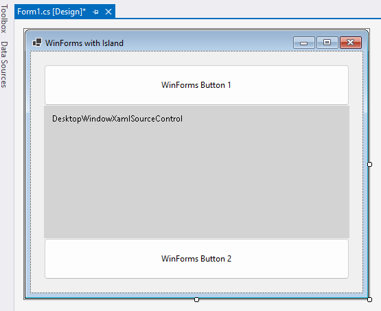
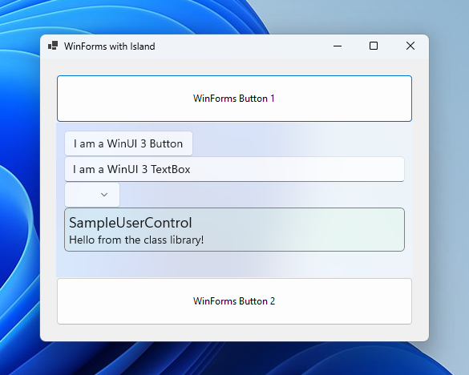

# SimpleIslandApp

This sample shows how to add a WinAppSDK ContentIsland with Xaml content to a Win32 app.  It was first created with the C++ "Windows Desktop Application"
template in Visual Studio, which yields a boilerplate Win32 app that uses Windows APIs that have been around for a long time.

This sample is an "unpackaged" app, so it will run like a win32 app that hasn't been changed for a while.

This sample uses Windows App SDK as a "framework package".  This means that the Windows App SDK runtime must be installed for it to run.

## What is a WinAppSDK ContentIsland?

A WinAppSDK ContentIsland is a set of APIs that allows an app author to connect two UI frameworks together.  This sample demonstrates how
to connect Xaml content into a Win32 app.

## Prerequisites

* See [System requirements for Windows app development](https://docs.microsoft.com/windows/apps/windows-app-sdk/system-requirements).
* Make sure that your development environment is set up correctly&mdash;see [Install tools for developing apps for Windows 10 and Windows 11](https://docs.microsoft.com/windows/apps/windows-app-sdk/set-up-your-development-environment).

## Building and running the sample

* Open the solution file (`.sln`) in Visual Studio.
* Press Ctrl+Shift+B, or select **Build** \> **Build Solution**.
* Press Ctrl+F5 to launch the app (without attaching a debugger)
    > Note: If the Windows App SDK runtime isn't installed on the machine, the user will see a message box directing them to a download link.
* Press F5 to launch the app under a debugger.
    > Note: When running under a debugger, you may see an "Exception Thrown" dialog box in Visual Studio.  You can safely press the "Continue"
    button to proceed.
* To run from the command line or File Explorer, navigate to `<arch>/<config>/SimpleIslandApp` directory and run SimpleIslandApp.exe.
* To deploy to another machine, copy the `<arch>/<config>/SimpleIslandApp` directory to that machine and run SimpleIslandApp.exe.  The sample
runs on Windows version 17763 and later.

## How to add a ContentIsland with Xaml content to your own Win32 app

Here's the basic steps to add an island to your own Win32 app, leveraging code from this sample:
1. Add a NuGet reference to the Microsoft.WindowsAppSDK package (latest stable version).
2. Add a NuGet reference to the Microsoft.Windows.CppWinRT package (latest stable version).
3. Make some modifications to your vcxproj file and main message loop -- look for the tag "Island-support" in the sample code.
4. Add an implementation for your Xaml App object.  Feel free to copy the App.\* files from this sample, as well as the vcxproj entries.
The App object is needed for many of the Xaml controls to work, and it also enables metadata lookups for your app.
5. Optional: Add a MainPage to create your first page of Xaml.  You can copy it from this sample app.
6. Modify your application to create your Xaml App object.  After that, create a DesktopWindowXamlSource object to hold
your Xaml content and position it within your HWND in your app wherever you'd like.

# UXFrameworksOnIslands

This sample shows how to integrate different UX frameworks within a single application using the 
enhancements to the WinAppSDK ContentIsland APIs introduced in release 1.7.0. It provides practical 
examples and best practices to achieve a seamless state-of-the-art user experience across multiple 
UX frameworks. 

The examples include but are not limited to the following:

- Create a DispatcherQueueController on the UI thread and a System 
DispatcherQueueController on a dedicated rendering thread. (main.cpp)
- Create a hierarchy of ContentIslands:
    - Create and configure a DesktopAttachedSiteBridge. (TopLevelWindow.cpp) 
    - Connect a System ContentIsland with DesktopAttachedSiteBridge. (TopLevelWindow.cpp)
    - Connect a System ContentIsland with a System ContentIsland. (RootFrame.cpp)
    - Connect a ContentIsland with a System ContentIsland. (NetUIFrame.cpp)
    - Connect a ContentIsland with a ContentIsland. (ReactNativeFrame.cpp)
    - Create a DesktopPopupSiteBridge from a ContentIsland. (WinUIFrame.cpp)
    - Connect a ContentIsland with DesktopPopupSiteBridge. (PopupFrame.cpp)
- Input: Pointer and keyboard processing. (RootFrame.cpp, ReactNativeFrame.cpp) 
- Input: Focus management. (FocusManager.cpp, FocusList.cpp)
- Input: Keyboard accelerators. (main.cpp, PreTranslateHandler.cpp, ReactNativeFrame.cpp)
- Layout: Top-level window resize. (RootFrame.cpp)
- Layout: Display scale change. (RootFrame.cpp)
- Layout: Snap to the pixel grid. (FrameDocker.cpp)
- Layout: Crisp text rendering. (TextRenderer.cpp)
- Accessibility: Support for ContentAutomationOption (IFrameHost.h, AutomationTree.cpp)

## Building and running the sample

* Open the solution file (`.sln`) in Visual Studio.
* Press Ctrl+Shift+B, or select **Build** \> **Build Solution**.
* Press Ctrl+F5 to launch the app without attaching a debugger.
* Press F5 to launch the app under a debugger.

# WinForms Island App (cs-winforms-unpackaged)

The cs-winforms-unpackaged directory has a sample shows how to add a WinAppSDK island with Xaml content to a WinForms app. 
It was first created with the C# "Windows Forms App" template in Visual Studio, which yields a boilerplate WinForms app.

This sample is an "unpackaged" app, so it will run like a WinForms/Win32 app does when built from the default templates.

This sample uses Windows App SDK as a "framework package".  This means that the Windows App SDK runtime must be installed for it to run.

## Prerequisites

* See [System requirements for Windows app development](https://docs.microsoft.com/windows/apps/windows-app-sdk/system-requirements).
* Make sure that your development environment is set up correctly&mdash;see [Install tools for developing apps for Windows 10 and Windows 11](https://docs.microsoft.com/windows/apps/windows-app-sdk/set-up-your-development-environment).

## Building and running the WinForms Island sample

* Open the solution file (`.sln`) in Visual Studio.
* Press Ctrl+Shift+B, or select **Build** \> **Build Solution**.
* Press Ctrl+F5 to launch the app (without attaching a debugger)
    > Note: If the Windows App SDK runtime isn't installed on the machine, the user will see a message box directing them to a download link.
* Press F5 to launch the app under a debugger.
* To run from the command line or File Explorer, navigate to `bin/<arch>/<config>/net6.0-windows10.0.17763.0` directory and run WinFormsWithIslandApp.exe.
* To deploy to another machine, copy the `bin/<arch>/<config>/net6.0-windows10.0.17763.0` directory to that machine and run WinFormsWithIslandApp.exe.  The sample
runs on Windows version 17763 and later.

In Visual Studio, you should also be able to see the DesktopWindowXamlSourceControl in the designer:

When you launch the app, it should look like this:

