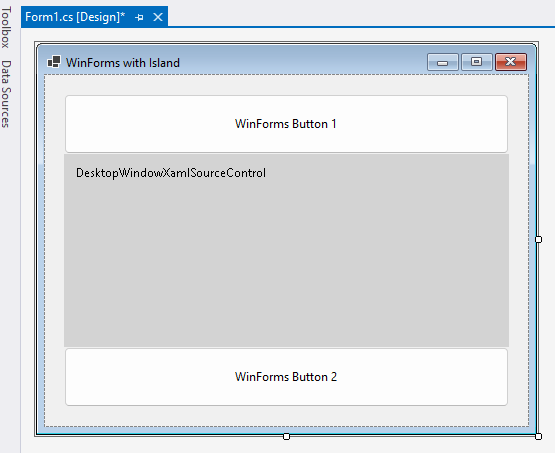
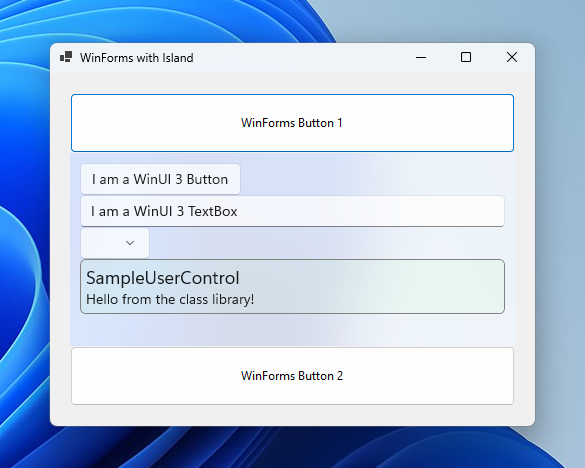

# WinForms Island App (cs-winforms-unpackaged)

The cs-winforms-unpackaged directory has a sample shows how to add a WinAppSDK island with Xaml content to a WinForms app. 
It was first created with the C# "Windows Forms App" template in Visual Studio, which yields a boilerplate WinForms app.

This sample is an "unpackaged" app, so it will run like a WinForms/Win32 app does when built from the default templates.

This sample uses Windows App SDK as a "framework package".  This means that the Windows App SDK runtime must be installed for it to run.

It also shows how to use a UserControl named "SampleUserControl" that's defined in a separate "WinUI Class Library" DLL called
"SampleWinUIClassLibrary".  To make this work, the XamlApp type knows how to route Xaml metadata requests to the SampleWinUIClassLibrary's
XamlMetadataProvider object.

## Prerequisites

* See [System requirements for Windows app development](https://docs.microsoft.com/windows/apps/windows-app-sdk/system-requirements).
* Make sure that your development environment is set up correctly&mdash;see [Install tools for developing apps for Windows 10 and Windows 11](https://docs.microsoft.com/windows/apps/windows-app-sdk/set-up-your-development-environment).

## Building and running the WinForms Island sample

* Open the solution file (`.sln`) in Visual Studio.
* Press Ctrl+Shift+B, or select **Build** \> **Build Solution**.
* Press Ctrl+F5 to launch the app (without attaching a debugger)
    > Note: If the Windows App SDK runtime isn't installed on the machine, the user will see a message box directing them to a download link.
* Press F5 to launch the app under a debugger.
* To run from the command line or File Explorer, navigate to `bin/<arch>/<config>/net8.0-windows10.0.17763.0` directory and run WinFormsWithIslandApp.exe.
* To deploy to another machine, copy the `bin/<arch>/<config>/net8.0-windows10.0.17763.0` directory to that machine and run WinFormsWithIslandApp.exe.  The sample
runs on Windows version 17763 and later.

In Visual Studio, you should also be able to see the DesktopWindowXamlSourceControl in the designer:

When you launch the app, it should look like this:

