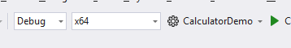
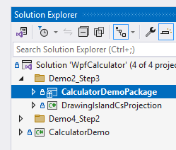

Here's the basic process:

**Demo2_Step2_RunCalcWithThemes**
* Open WpfCalculator.sln.
* Ensure settings are: 

* ctrl+f5

**Demo2_Step3_AddPackaging**
* Change Startup project to:

* ctrl+f5
* App runs, and looks the same.  Note how the Start Menu now contains "CalculatorDemoPackage".

**Demo3_Step2_AddCompact**
* Remove comments for "Demo3_Step1_AddWasdk"
* ctrl+f5
* App now has "compact" mode

**Demo4_Step2_AddIsland**
* Remove comments for "Demo4_Step2_AddIsland"
* ctrl+f5
* App now has an option File | Add DrawingIsland.

