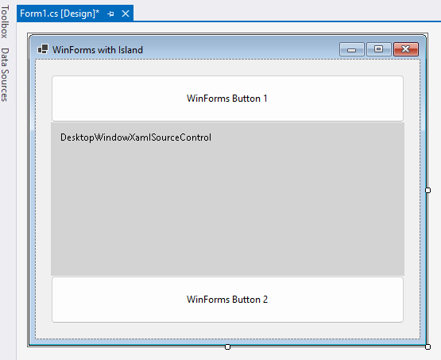
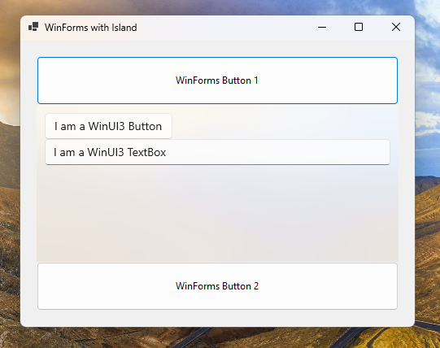

# WinForms Island App

This sample shows how to add a WinAppSDK island with Xaml content to a WinForms app.  It was first created with the C# "Windows Forms App"
template in Visual Studio, which yields a boilerplate WinForms app.

This sample is an "unpackaged" app, so it will run like a WinForms/win32 app does when built from the default templates.

This sample uses Windows App SDK as a "framework package".  This means that the Windows App SDK runtime must be installed for it to run.

## What is a WinAppSDK Island?

A WinAppSDK island is a set of APIs that allows an app author to connect two UI frameworks together.  This sample demonstrates how
to connect Xaml content into a WinForms app.

## Prerequisites

* See [System requirements for Windows app development](https://docs.microsoft.com/windows/apps/windows-app-sdk/system-requirements).
* Make sure that your development environment is set up correctly&mdash;see [Install tools for developing apps for Windows 10 and Windows 11](https://docs.microsoft.com/windows/apps/windows-app-sdk/set-up-your-development-environment).

## Building and running the sample

* Open the solution file (`.sln`) in Visual Studio.
* Press Ctrl+Shift+B, or select **Build** \> **Build Solution**.
* Press Ctrl+F5 to launch the app (without attaching a debugger)
    > Note: If the Windows App SDK runtime isn't installed on the machine, the user will see a message box directing them to a download link.
* Press F5 to launch the app under a debugger.
* To run from the command line or File Explorer, navigate to `bin/<arch>/<config>/net6.0-windows10.0.17763.0` directory and run WinFormsWithIslandApp.exe.
* To deploy to another machine, copy the `bin/<arch>/<config>/net6.0-windows10.0.17763.0` directory to that machine and run WinFormsWithIslandApp.exe.  The sample
runs on Windows version 17763 and later.

In Visual Studio, you should also be able to see the DesktopWindowXamlSourceControl in the designer:

When you launch the app, it should look like this:

# How to add an Island with Xaml content to your own Win32 app

Here's the basic steps to add an island to your own WinForms app, leveraging code from this sample:
1. Add a NuGet reference to the Microsoft.WindowsAppSDK package (latest stable version).
2. Make some modifications to your csproj file and Program.cs to work with the WindowsAppSDK UI stack --
look for the tag `Island-support` in the sample code.
3. Add an implementation for your Xaml App object.  Feel free to copy the XamlApp.cs files from this sample.
The App object is needed for many of the Xaml controls to work, and it also enables metadata lookups for your app.
4. Modify your application to create your Xaml App object.  After that, create a DesktopWindowXamlSource object to hold
your Xaml content and position it within your HWND in your app wherever you'd like.
5. Copy `DesktopWindowXamlSourceControl.*` to your app.  This type is a general-purpose way to put a DesktopWindowXamlSource
into your WinForms app.
6. Copy `WindowsAppSdkHelper.cs` to your app, this just has some helper code.

