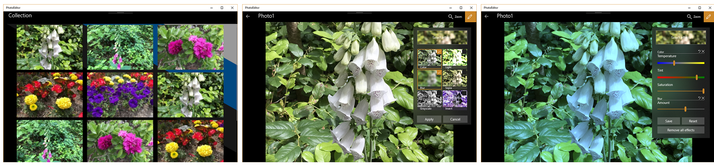

<!---
  category: ControlsLayoutAndText FilesFoldersAndLibraries
-->

# Photo Editor sample application

A mini-app for viewing and editing image files, demonstrating XAML layout, data binding, and UI customization features for Windows App SDK apps. Photo Editor shows you how to retrieve photos from the **Pictures** library, and then edit the selected image with assorted photo effects. In the sample's source code, you'll see a number of common practices such as [data binding](https://docs.microsoft.com/windows/uwp/data-binding/data-binding-quickstart) and [asynchronous programming](https://docs.microsoft.com/windows/uwp/threading-async/asynchronous-programming-universal-windows-platform-apps).

> **Note**. This sample is targeted and tested for the Windows App SDK [version 1.0 Stable](https://docs.microsoft.com/windows/apps/windows-app-sdk/stable-channel) and Visual Studio 2022.

### PhotoEditor C++ Sample Application

### PhotoEditor C# Sample Application

## Features

Photo Editor demonstrates:

* XAML layout ranging from basics to adaptive and tailored layouts.
* XAML data binding including the [{x:Bind} markup extension](https://docs.microsoft.com/windows/uwp/xaml-platform/x-bind-markup-extension).
* XAML styling and UI customization, including [connected animations](https://docs.microsoft.com/windows/uwp/design/motion/connected-animation).
* Image effects from [**Windows.UI.Composition**](https://docs.microsoft.com/uwp/api/windows.ui.composition).
* Loading images from the **Pictures** library using data virtualization to increase performance when there are numerous files.
* The [**Microsoft.Graphics.Win2D**](https://microsoft.github.io/Win2D/WinUI3/html/Introduction.htm) NuGet package (an easy-to-use Windows Runtime API for immediate-mode 2D graphics rendering).
For WinUI).

### C++/WinRT-specific features

The C++/WinRT-specific features that Photo Editor demonstrates include:

- Use of coroutines, including the use of co_await, co_return, [**IAsyncAction**](https://docs.microsoft.com/uwp/api/windows.foundation.iasyncaction), and [**IAsyncOperation&lt;TResult&gt;**](https://docs.microsoft.com/uwp/api/windows.foundation.iasyncoperation_tresult_). Also see [asynchronous actions and operations](https://docs.microsoft.com/windows/uwp/cpp-and-winrt-apis/concurrency).
- Creation and use of custom Windows Runtime class (runtime class) projected types and implementation types. For more info about these terms, see [Consume APIs with C++/WinRT](https://docs.microsoft.com/windows/uwp/cpp-and-winrt-apis/consume-apis) and [Author APIs with C++/WinRT](https://docs.microsoft.com/windows/uwp/cpp-and-winrt-apis/author-apis).
- [Event handling](https://docs.microsoft.com/windows/uwp/cpp-and-winrt-apis/handle-events), including the use of auto-revoking event tokens.
- XAML [data binding](https://docs.microsoft.com/windows/uwp/cpp-and-winrt-apis/binding-property).

## Prerequisites

* See [System requirements for Windows app development](https://docs.microsoft.com/windows/apps/windows-app-sdk/system-requirements).
* Make sure that your development environment is set up correctly&mdash;see [Install tools for developing apps for Windows 10 and Windows 11](https://docs.microsoft.com/windows/apps/windows-app-sdk/set-up-your-development-environment).
* You'll need to have a collection of images available in your local **Pictures** folder. If there are no images or photos available at that location, then the app will show only the background when you run it.

To get the latest updates to Windows and the development tools, and to help shape their development, join the [Windows Insider Program](https://insider.windows.com).

## Building and running the sample

* Open the solution file (`.sln`) in Visual Studio.
* From Visual Studio, either **Start Without Debugging** (Ctrl+F5) or **Start Debugging** (F5).

## Code at a glance (C++/WinRT)

If you're just interested in code snippets for certain areas, and you don't want to browse or run the full sample, then check out the following files.

A custom runtime class that represents a photo.

* [Photo.idl](PhotoEditor/cpp-winui/PhotoEditor/Photo.idl)
  * [Photo.h](PhotoEditor/cpp-winui/PhotoEditor/Photo.h)
  * [Photo.cpp](PhotoEditor/cpp-winui/PhotoEditor/Photo.cpp)

The main page, which loads the photos from the Pictures Library and displays a tiled thumbnail view.

* [MainPage.xaml](PhotoEditor/cpp-winui/PhotoEditor/MainPage.xaml)
  * [MainPage.idl](PhotoEditor/cpp-winui/PhotoEditor/MainPage.idl)
  * [MainPage.h](PhotoEditor/cpp-winui/PhotoEditor/MainPage.h)
  * [MainPage.cpp](PhotoEditor/cpp-winui/PhotoEditor/MainPage.cpp)

Tapping a photo from the **MainPage** thumbnail view takes you to the photo editor page, where Win2D effects are toggled, set, and chained together.

* [DetailPage.xaml](PhotoEditor/cpp-winui/PhotoEditor/DetailPage.xaml)
  * [DetailPage.idl](PhotoEditor/cpp-winui/PhotoEditor/DetailPage.idl)
  * [DetailPage.h](PhotoEditor/cpp-winui/PhotoEditor/DetailPage.h)
  * [DetailPage.cpp](PhotoEditor/cpp-winui/PhotoEditor/DetailPage.cpp)

## Code at a glance (C#)

If you're just interested in code snippets for certain areas and don't want to browse or run the full sample, check out the following files for examples of some highlighted features:

* Layout: see [MainPage.xaml](PhotoEditor/cs-winui/MainPage.xaml) and [DetailPage.xaml](PhotoEditor/cs-winui/DetailPage.xaml)
* Data binding with x:Bind: see ImageGridView_DefaultItemTemplate in [MainPage.xaml](PhotoEditor/cs-winui/MainPage.xaml)
* Styling and customization: see FancySliderControlTemplate in [DetailPage.xaml](PhotoEditor/cs-winui/DetailPage.xaml)
* Image effects: see code starting with  InitializeEffects in [DetailPage.xaml.cs](PhotoEditor/cs-winui/DetailPage.xaml.cs)

## Related documentation and code samples

* [Controls and patterns](https://docs.microsoft.com/windows/uwp/controls-and-patterns/index)
* [Layout](https://docs.microsoft.com/windows/uwp/layout/)
* [Data binding in depth](https://docs.microsoft.com/windows/uwp/data-binding/data-binding-in-depth)
* [Style guide](https://docs.microsoft.com/windows/uwp/style/)
* [Visual layer](https://docs.microsoft.com/windows/uwp/composition/visual-layer)
* [ListView and GridView data virtualization](https://docs.microsoft.com/windows/uwp/debug-test-perf/listview-and-gridview-data-optimization)
* [Data virtualization sample](https://github.com/Microsoft/Windows-universal-samples/tree/master/Samples/XamlDataVirtualization)

## External libraries used in this sample

* [**Microsoft.Graphics.Win2D**](https://microsoft.github.io/Win2D/WinUI3/html/Introduction.htm)

## Changing the project's target platform version (C++/WinRT)

If you build the project on a given target platform version (`TargetPlatformVersion` in the project file), and then you retarget and rebuild, you might see this error message in Visual Studio: "error MIDL2003: [msg]redefinition [context]: <SYMBOL>". If you do, then here are some options to resolve the issue.

- Sometimes, the resolution is as simple as deleting the file `\cpp-winui\PhotoEditor\<CONFIGURATION>\XamlMetaDataProvider.idl`, and rebuilding.
- If that doesn't clear the issue, then you can try deleting all temporary/generated folders and files, and rebuilding.
- If you haven't made changes, then you can alternatively re-clone the repo, re-target, and build.
