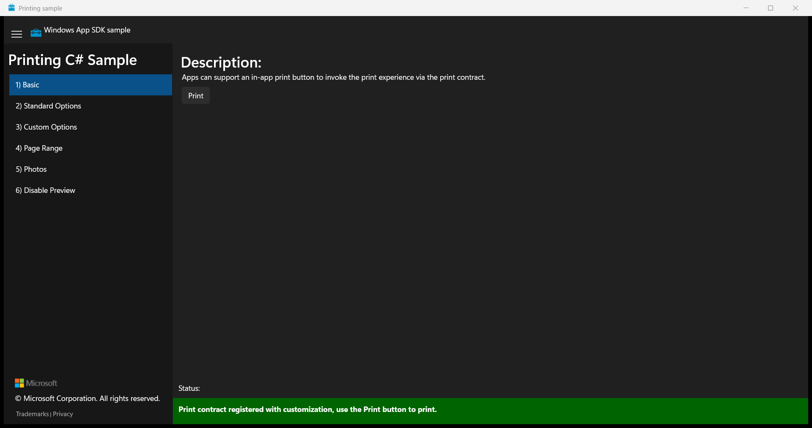

# Printing sample

This sample demonstrates how to print content from a WinUI 3 desktop app that
uses the Windows App SDK.

## Features

- Open the Windows print experience from a WinUI 3 window.
- Print basic text and images with `PrintDocument`.
- Configure standard print options.
- Add a custom print option.
- Select a page range.
- Lay out and print a collection of photos.
- Disable print preview when an app cannot provide it.
- Run the sample as either a packaged or unpackaged app.

## Prerequisites

- Windows 10, version 1809 (build 17763), or later.
- Visual Studio with the .NET desktop development workload.

## Build and run the sample

1. Open `cs-winui\PrintingSample.sln` in Visual Studio.
2. Select an x86, x64, or ARM64 configuration.
3. Select the `PrintingSample (Package)` profile for packaged deployment or
   the `PrintingSample (Unpackaged)` profile for unpackaged deployment.
4. Build and run the solution.
5. Select a scenario and choose **Print** to open the Windows print experience.

## Related links

- [Print from your app][print-from-app]

[print-from-app]: https://learn.microsoft.com/windows/apps/develop/devices-sensors/print-from-your-app
