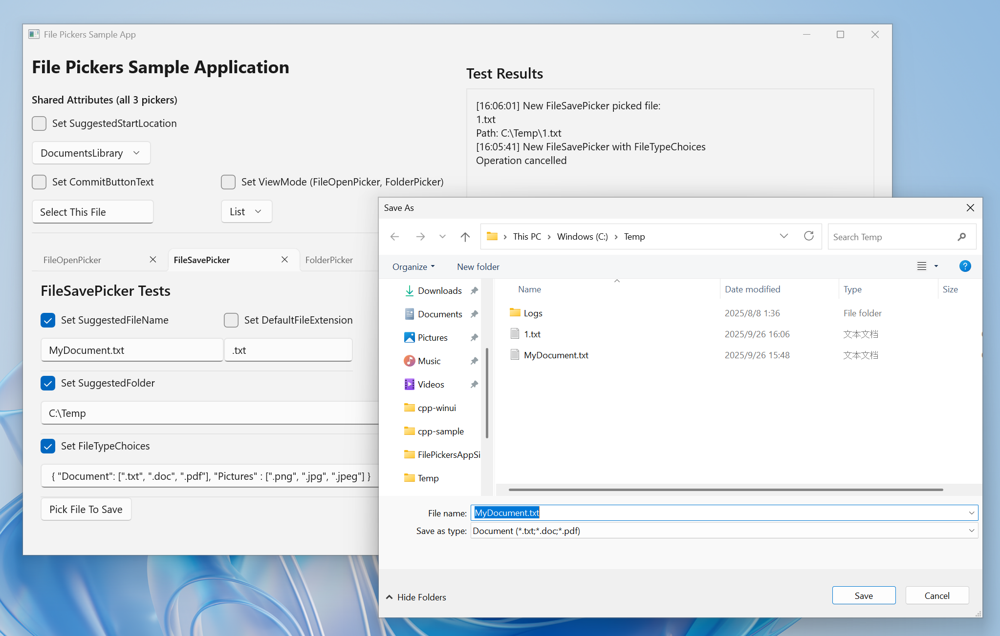

## The Storage Pickers Samples

- Demonstrates the `Microsoft.Windows.Storage.Pickers` APIs inside a Windows App SDK app.
- Targets Windows App SDK **1.8 or later**.
- Three tabs showcase `FileOpenPicker`, `FileSavePicker`, and `FolderPicker` usage end to end.

## 📸 Screenshot of App Layout

## 🚀 Run

1. Open `cpp-sample/FilePickersAppSinglePackaged.sln` or `cs-sample/FilePickersAppSinglePackaged.sln` in Visual Studio 2022.
1. Restore NuGet packages and ensure the Windows App SDK 1.8 runtime is installed locally.
1. Build and run.

## More to explore

- [Storage pickers specs](https://github.com/microsoft/WindowsAppSDK/blob/release/1.8-stable/specs/Storage.Pickers/Microsoft.Windows.Storage.Pickers.md)
- [Windows App SDK](https://github.com/microsoft/WindowsAppSDK/tree/main)
