## The Storage Pickers Samples

- Demonstrates the `Microsoft.Windows.Storage.Pickers` APIs inside a Windows App SDK app.
- Targets Windows App SDK **1.8 or later**.
- Three tabs showcase `FileOpenPicker`, `FileSavePicker`, and `FolderPicker` usage end to end.

## 📸 Screenshot of App Layout

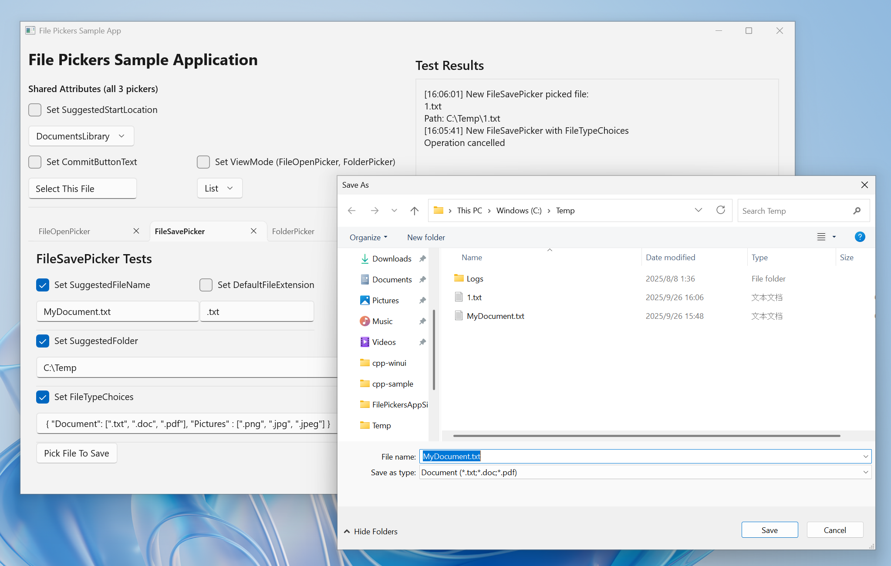

## Deploy the Sample Packaged App Locally

1. Open `cpp-sample/FilePickersAppSinglePackaged.sln` or `cs-sample/FilePickersAppSinglePackaged.sln` in Visual Studio, right click on the project, select "Package and Publish" > "Create App Package"

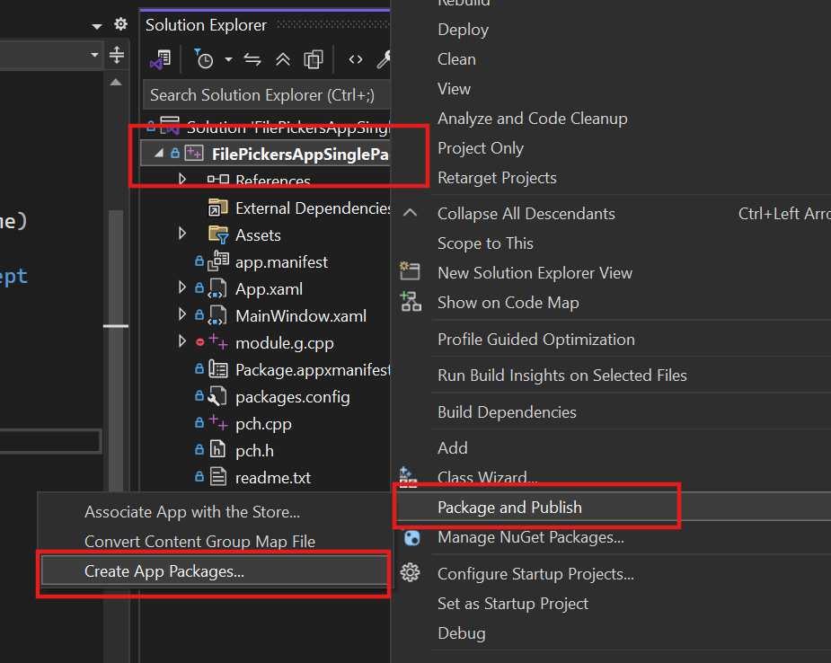

2. Select Sideloading > Next

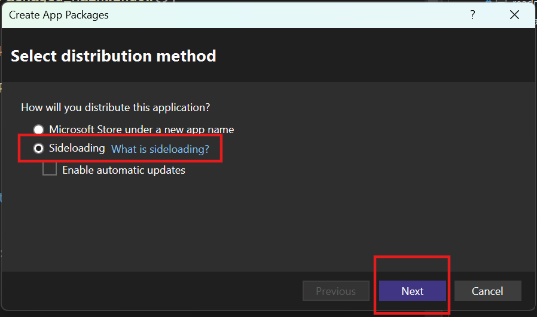

3. Create and Trust your own test certification

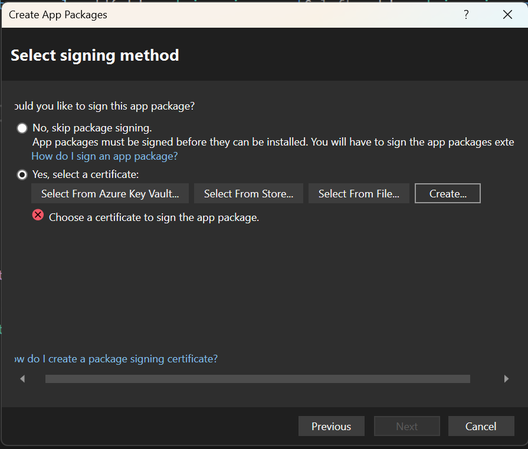

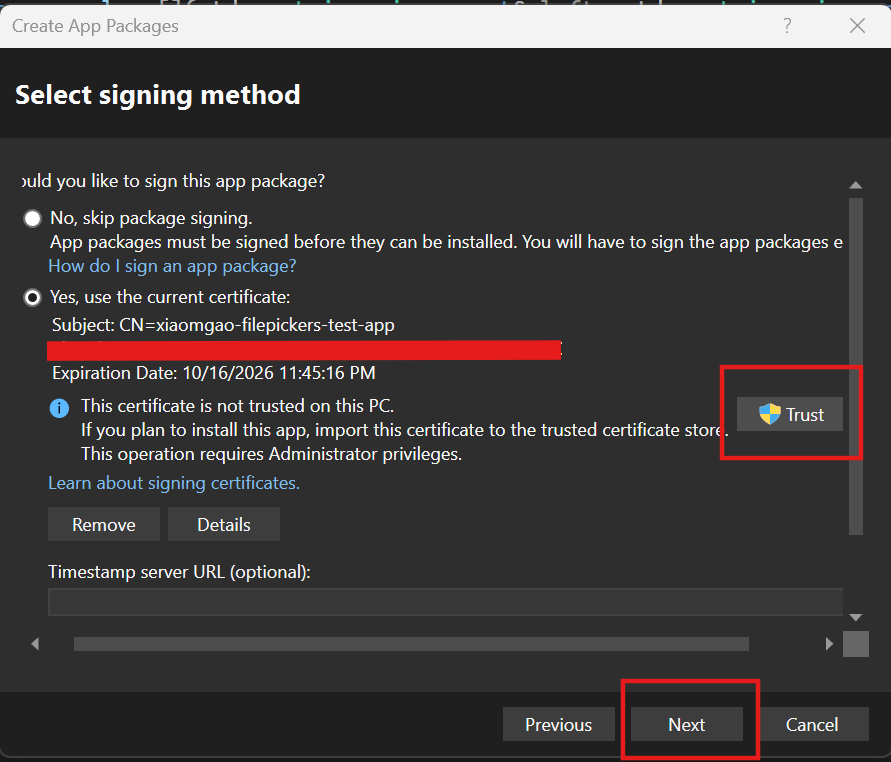

4. Create package

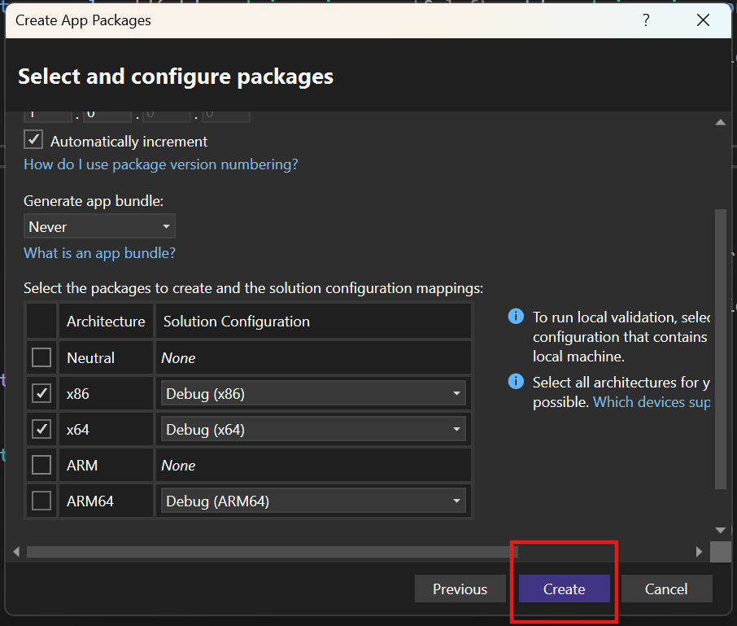

5. Open the built result

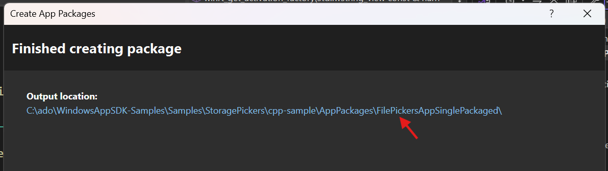

5. Run Install.ps1 in powershell

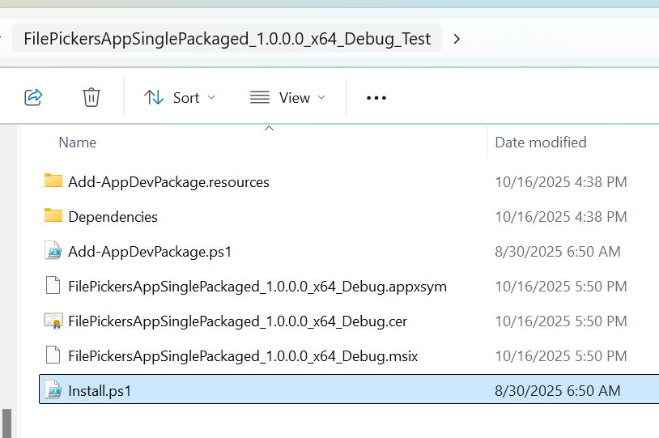

*Note:*

If encountering error like below:

> Add-AppxPackage: Cannot find path 'C:\FilePickersAppSinglePackaged_1.0.1.0_x64_Debug_Test\Dependencies\x86\Microsoft.VCLibs.x86.Debug.14.00.appx C:\FilePickersAppSinglePackaged_1.0.1.0_x64_Debug_Test\Dependencies\x86\Microsoft.VCLibs.x86.Debug.14.00.Desktop.appx C:\FilePickersAppSinglePackaged_1.0.1.0_x64_Debug_Test\Dependencies\x64\Microsoft.VCLibs.x64.Debug.14.00.appx C:\FilePickersAppSinglePackaged_1.0.1.0_x64_Debug_Test\Dependencies\x64\Microsoft.VCLibs.x64.Debug.14.00.Desktop.appx' because it does not exist.

Replace lines 483-491 in `Add-AppDevPackage.ps1` with below script and try again:

```ps
if ($DependencyPackages.FullName.Count -gt 0)
{
    Write-Host $UiStrings.DependenciesFound
    $DependencyPackages.FullName
    

    # Install dependencies one by one first
    foreach ($dep in $DependencyPackages.FullName) {
        echo "Installing dependency: $dep"
        try {
            Add-AppxPackage -Path $dep -ForceApplicationShutdown
            echo "Successfully installed: $dep"
        } catch {
            echo "Failed to install dependency: $dep - $($_.Exception.Message)"
        }
    }
    
    # Now install the main package
    echo "Installing main package: $($DeveloperPackagePath.FullName)"
    Add-AppxPackage -Path $DeveloperPackagePath.FullName -ForceApplicationShutdown
}
```

Screenshot of this error:
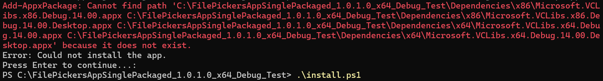

Screenshot of this mitigation:

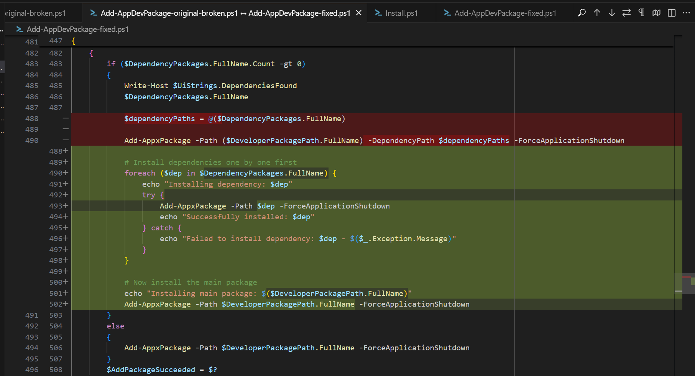

With the dependency *.appx files correctly installed, the project should be debugged in Visual Studio smoothly.

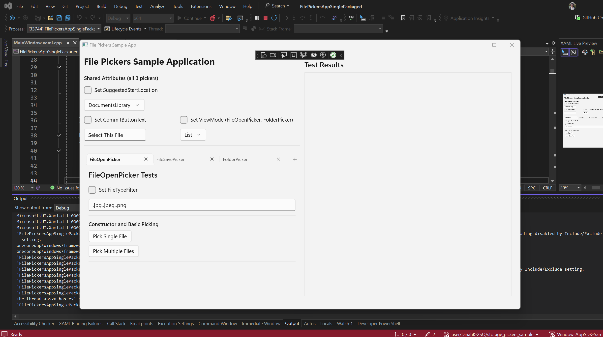


## 🚀 Run

1. Open `cpp-sample/FilePickersAppSinglePackaged.sln` or `cs-sample/FilePickersAppSinglePackaged.sln` in Visual Studio.
1. Restore NuGet packages and ensure the Windows App SDK 1.8 runtime is installed locally.
1. Build and run.


## More to explore

- [Microsoft.Windows.Storage.Pickers Namespace](https://learn.microsoft.com/en-us/windows/windows-app-sdk/api/winrt/microsoft.windows.storage.pickers)
- [Design Specs of Microsoft.Windows.Storage.Pickers](https://github.com/microsoft/WindowsAppSDK/blob/release/1.8-stable/specs/Storage.Pickers/Microsoft.Windows.Storage.Pickers.md)
- [Windows App SDK](https://github.com/microsoft/WindowsAppSDK/)
