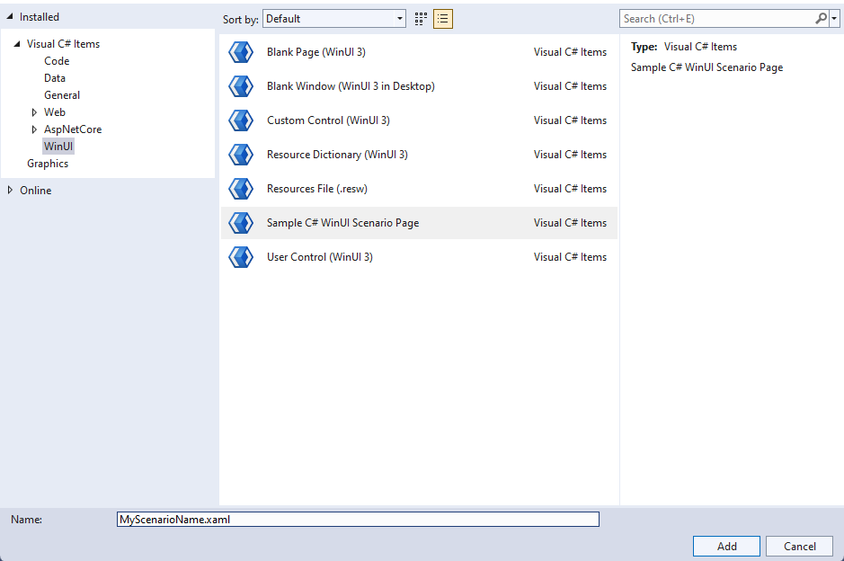

# Windows App SDK Sample Templates

The `Templates` folder contains WinUI3-based sample templates for C# and C++/WinRT. **WindowsAppSDKSampleVsix.sln** builds a VSIX file which provides project and item templates for Visual Studio 2022 for sample authors.

## Prerequisites

The following are prequisites to using the sample templates:

- Visual Studio 2022, with the following **Workloads** installed:
   - Universal Windows Platform development
   - Desktop development with C++
   - .NET Desktop Development
- [Single-project MSIX Packaging tools for Visual Studio 2022](https://marketplace.visualstudio.com/items?itemName=ProjectReunion.MicrosoftSingleProjectMSIXPackagingToolsDev17)
- [Sample template VSIX](https://github.com/microsoft/WindowsAppSDK-Samples/releases)

## Usage

1. Download the Windows App SDK Sample VSIX from the [releases page](https://github.com/microsoft/WindowsAppSDK-Samples/releases). The VSIX will install the following templates:

    - Project Templates: Windows App SDK Sample C# WinUI, Windows App SDK Sample C++ WinUI
    - Item Templates: Sample C# WinUI Scenario Page, Sample C++ WinUI Scenario Page

2. Create a new project in Visual Studio 2022. In the New Project dialog, search for either *Windows App SDK C# Sample* or *Windows App SDK C++ Sample*.

    

3. Replace the Project name with your feature name, for example *Windowing*. Check the box for "Place solution and project in the same directory".

    

4. Sample development should be done in the *ScenarioX_ScenarioName* files. All other files including the Settings, App, and MainWindow/MainPage files should not need any changes.

5. To add a new Scenario Page, right-click on the project and select *Add* -> *New Item*. Select *WinUI* in the left column and choose *Sample C#/C++ WinUI Scenario Page*. Name the file with your Scenario name.

    

    You will also need to add the page to the scenario list in *SampleConfiguration.cs* or *SampleConfiguration.cpp* in order to display the new page in the navigation view.

## Tips and Best Practices

* The VSIX comes preinstalled with a public version of the Windows App SDK package. To develop your samples with an internal package version, first configure your NuGet package sources and then modify the package version in your project.

* For C++ samples, consolidate all *.idl* code into the *Project.idl* file. If you add additional Scenario pages to the project, copy and paste the contents of the newly created *ScenarioName.idl* files into *Project.idl*, and delete any extra *.idl* files.

## Troubleshooting

* Deploying the single-project MSIX requires checking *Deploy* in *Build* -> *Configuration Manager* for each Platform/Configuration.
